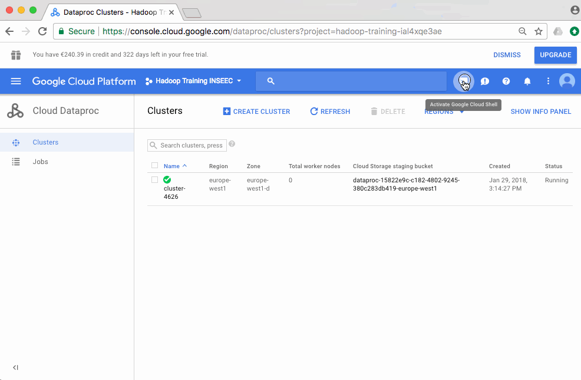

# Hadoop streaming exercises
This directory contains Hadoop MapReduce examples for the data that course participants have access to. Hadoop streaming is what allows us to use Python to code mappers and reducers instead of Java.

## Count number of page visits per site
This is the easiest possible MapReduce example.

### Running on your computer
Download a sample of the data sample from GCS to your computer.

Using tools available on macOS and Linux:

```
cat <input_data> | cut -f1 | sort | uniq -c | sort -n
```

Test the MapReduce code on your computer:

Note that the `sort` command takes the place of the "sort & shuffle". There is no real shuffle happening since we are not distributing anything between several servers or processes.

```
cat <input-data> | ./count_page_visits_per_site.py map | sort -k1 | ./count_page_visits_per_site.py reduce
```

You should find the same results in both cases!

### Running on Dataproc
You will need to replace `<*>` parameters below with the ones that correspond to your setup. You also have to delete the output data if you plan to write to the same output location again.

```
gcloud dataproc \
    --region <your-cluster-region> \
    jobs submit hadoop \
    --cluster <your-cluster-name> \
    --jar file:///usr/lib/hadoop-mapreduce/hadoop-streaming.jar \
    --files <path-to>/count_page_visits_per_site.py \
    -- \
    -input gs://<your-bucket>/<input-data> \
    -output gs://<your-bucket>/page-visits-per-site \
    -mapper 'count_page_visits_per_site.py map' \
    -reducer 'count_page_visits_per_site.py reduce'
```

### Getting more help about Hadoop streaming
- [Documentation](https://hadoop.apache.org/docs/stable/hadoop-streaming/HadoopStreaming.html)

Run the class without any arguments:

```
dataproc \
    --region <your-cluster-region> \
    jobs submit hadoop \
    --cluster <your-cluster-name> \
    --jar file:///usr/lib/hadoop-mapreduce/hadoop-streaming.jar \
    -- \
    -help
```

## Count number of visitors per site
This is a slightly more advanced example which can be solved using a sequence of 2 MapReduce jobs or a single one by controlling partitioning.

### Running on your computer
Using tools available on macOS and Linux:

```
cat <input-data> | cut -f1,2 | sort -t$'\t' | uniq | cut -f1 | uniq -c
```

Test the MapReduce code locally:

```
cat <input-data> | ./count_visitors_per_site.py map | sort -t$'\t' -k1,1 -k2,2 | ./count_visitors_per_site.py reduce
```

You should find the same results in both cases!

### Running on Dataproc
```
gcloud dataproc \
    --region <your-cluster-region> \
    jobs submit hadoop \
    --cluster <your-cluster> \
    --jar file:///usr/lib/hadoop-mapreduce/hadoop-streaming.jar \
    --files  <path-to>/count_visitors_per_site.py \
    --properties '^;^mapred.job.name=count-visitors-per-site;mapreduce.job.output.key.comparator.class=org.apache.hadoop.mapreduce.lib.partition.KeyFieldBasedComparator;stream.num.map.output.key.fields=2;mapreduce.partition.keypartitioner.options=-k1,1' \
    -- \
    -input gs://<your-bucket>/<input-data> \
    -output gs://<your-bucket>/count-visitors-per-site-out \
    -mapper 'count_visitors_per_site.py map' \
    -reducer 'count_visitors_per_site.py reduce' \
    -partitioner org.apache.hadoop.mapred.lib.KeyFieldBasedPartitioner

```

### Remarks
This could have been done with 2 MapReduce jobs:
1. Mapper: Emit `((IdSite, IdVisiteur), None)` key-value pairs, Reducer: De-duplicates `(IdSite, IdVisiteur)` keys.
2. Mapper: Emit `(IdSite, None)` key-value pairs, Reducer: Count number of key occurrences.

However, we do the same in one job by:
- Using partitioner that makes sure all same `IdSite` values go to the same partition (reducer).
- We indicate that our key is composed of 2 fields `(IdSite, IdVisiteur)`.
- The default sorting will make sure fields are sorted by `IdSite` and then `IdVisiteur` but we could make this more explicit by providing `- mapreduce.partition.keycomparator.options=-k1,1 -k2,2` as parameter to the Hadoop streaming `*.jar`.
- The leading `^;^` in the `--properties` argument is due to the fact that we have a `,` in the properties so we need to indicate that different properties are separated by `;` instead, see [documentation](https://cloud.google.com/sdk/gcloud/reference/topic/escaping).


### Tired of trying to install `gcloud` on your computer?
- You can submit jobs from the Google Cloud Shell, see image below. You will have to upload the Python script to GCS first and change the Dataproc command to reflect this: `--files gs://<your-bucket>/count_visitors_per_site.py`.
- I did not have success submitting Hadoop streaming jobs from the Dataproc UI on the GCP console. If you manage to - let me know.

