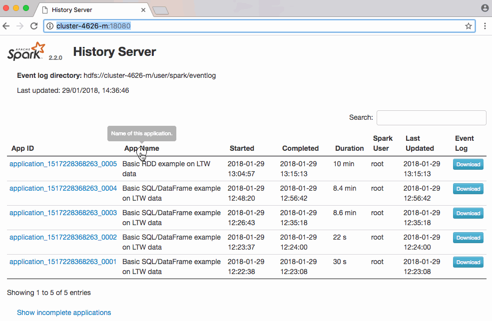

# Spark exercises
This directory contains simple Spark examples intended to be run in Jupyter. It also contains examples of using Spark on the data that course participants have access to on Google Cloud Storage (GCS). These later examples can serve as boilerplate for further development.

## Install Spark/Jupyter on your computer
```
pip install jupyter
pip install pyspark
```

You may also have to install `pip` before. Also, Java 8 needs to be installed. If you doubt that you have Java, do not install it and try running the examples. In any case do not install Java 9 which is currently not compatible with Spark.

### Alternative installations
- Download Spark from the Spark web site and follow instructions. You will also need Java installed.
- Install via Docker, see [here](https://github.com/jupyter/docker-stacks/tree/master/pyspark-notebook). This is completely walled-off but you have to download >5GB of packages.
- Do not install anything on your computer, use Jupyter directly on your Dataproc cluster, see official Google [documentation](https://cloud.google.com/dataproc/docs/tutorials/jupyter-notebook).

Useful Jupyter Notebook [shortcuts](https://www.cheatography.com/weidadeyue/cheat-sheets/jupyter-notebook/pdf_bw/).

## Running the Jupyter Notebook examples
If you have installed Jupyter on your computer change your current directory to this directory and run the following in your terminal: 
```
jupyter notebook
```

The `*.ipynb` should show up.

If you are running Jupyter on Google Dataproc upload the `*.ipynb` files via Jupyter's UI. Choose PySpark as Kernel. You will need to upload the `sample.csv` file as well but you will have to change the path to the file inside the notebook to something like `gs://<temporary-gs-bucket>/notebook/sample.csv`.

## Count number of visitors per site
This is the same example as for the Hadoop streaming exercises. It is easier to express this computation using Spark than it was with Hadoop MapReduce.

### Running on your computer
If you have PySpark installed on your computer download a data sample from GCS and simply run:

```
spark-submit <path-to>/count_visitors_per_site_sql_dataframe.py <input-data>
```

You need to replace `<*>` values above to match your environment.

### Running the examples on Dataproc
This is easier than running Hadoop streaming jobs (luckily):

```
gcloud dataproc \
    --region europe-west1 \
    jobs submit pyspark \
    --cluster <your-cluster> \
    <path-to>/count_visitors_per_site_sql_dataframe.py \
    -- \
    gs://<your-bucket>/<input-data>
```

You should see that the DataFrame and the SQL example generate the same execution plan and results:



The [RDD example script](count_visitors_per_site_rdd.py) can be run in the same way. It computes the exact same thing.

## Tired of trying to install `gcloud` and PySpark on your computer?
- You can submit PySpark jobs from the GCP Console web interface. 
- You can submit jobs from the Google Cloud Shell, see image below.

In either case you will have to upload your Python script to GCS first.

Finally, you can connect to `pyspark` interactive shell from the Google Cloud Shell after using it to log into your Dataproc cluster's master node. See image below.

